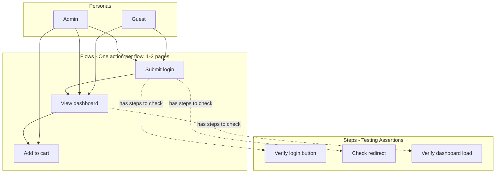

# Perceo

Perceo is an intelligent regression testing tool that uses multi-agent simulation to automatically detect affected flows and run targeted tests. The project is a Turborepo monorepo with pnpm workspaces.

## Perceo Conceptual Model

Perceo organizes testing around three core concepts with clear boundaries:

- **Personas** - Own flows. Personas are user types (e.g., admin, guest) and each persona uses a subset of flows.
- **Flows** - One specific action isolated to one page or at most a couple of pages. Each flow object represents a single user action (e.g., "Submit login form", "Add item to cart"). Flows form a connected graph; they connect when they share pages or when one flow leads to another (e.g., "Submit login" ends at `/dashboard`, "View dashboard" starts there).
- **Steps** - Testing artifacts. Steps are discrete assertions or checks to perform when validating a flow. They are not necessarily connected; they are things to verify during testing. Steps are generated initially at init and then incrementally as the app is tested.



See [docs/BOOTSTRAP_SPEC.md](docs/BOOTSTRAP_SPEC.md) for the init/bootstrap implementation spec.

---

## Turborepo Monorepo

This monorepo is built with Turborepo and maintained by the Turborepo core team.

## Using this example

Run the following command:

```sh
npx create-turbo@latest
```

## What's inside?

This Turborepo includes the following packages/apps:

### Apps and Packages

- `docs`: a [Next.js](https://nextjs.org/) app
- `web`: another [Next.js](https://nextjs.org/) app
- `@repo/ui`: a stub React component library shared by both `web` and `docs` applications
- `@repo/eslint-config`: `eslint` configurations (includes `eslint-config-next` and `eslint-config-prettier`)
- `@repo/typescript-config`: `tsconfig.json`s used throughout the monorepo

Each package/app is 100% [TypeScript](https://www.typescriptlang.org/).

### Utilities

This Turborepo has some additional tools already setup for you:

- [TypeScript](https://www.typescriptlang.org/) for static type checking
- [ESLint](https://eslint.org/) for code linting
- [Prettier](https://prettier.io) for code formatting

### Build

To build all apps and packages, run the following command:

```
cd my-turborepo

# With [global `turbo`](https://turborepo.dev/docs/getting-started/installation#global-installation) installed (recommended)
turbo build

# Without [global `turbo`](https://turborepo.dev/docs/getting-started/installation#global-installation), use your package manager
npx turbo build
yarn dlx turbo build
pnpm exec turbo build
```

You can build a specific package by using a [filter](https://turborepo.dev/docs/crafting-your-repository/running-tasks#using-filters):

```
# With [global `turbo`](https://turborepo.dev/docs/getting-started/installation#global-installation) installed (recommended)
turbo build --filter=docs

# Without [global `turbo`](https://turborepo.dev/docs/getting-started/installation#global-installation), use your package manager
npx turbo build --filter=docs
yarn exec turbo build --filter=docs
pnpm exec turbo build --filter=docs
```

### Develop

To develop all apps and packages, run the following command:

```
cd my-turborepo

# With [global `turbo`](https://turborepo.dev/docs/getting-started/installation#global-installation) installed (recommended)
turbo dev

# Without [global `turbo`](https://turborepo.dev/docs/getting-started/installation#global-installation), use your package manager
npx turbo dev
yarn exec turbo dev
pnpm exec turbo dev
```

You can develop a specific package by using a [filter](https://turborepo.dev/docs/crafting-your-repository/running-tasks#using-filters):

```
# With [global `turbo`](https://turborepo.dev/docs/getting-started/installation#global-installation) installed (recommended)
turbo dev --filter=web

# Without [global `turbo`](https://turborepo.dev/docs/getting-started/installation#global-installation), use your package manager
npx turbo dev --filter=web
yarn exec turbo dev --filter=web
pnpm exec turbo dev --filter=web
```

### Remote Caching

> [!TIP]
> Vercel Remote Cache is free for all plans. Get started today at [vercel.com](https://vercel.com/signup?/signup?utm_source=remote-cache-sdk&utm_campaign=free_remote_cache).

Turborepo can use a technique known as [Remote Caching](https://turborepo.dev/docs/core-concepts/remote-caching) to share cache artifacts across machines, enabling you to share build caches with your team and CI/CD pipelines.

By default, Turborepo will cache locally. To enable Remote Caching you will need an account with Vercel. If you don't have an account you can [create one](https://vercel.com/signup?utm_source=turborepo-examples), then enter the following commands:

```
cd my-turborepo

# With [global `turbo`](https://turborepo.dev/docs/getting-started/installation#global-installation) installed (recommended)
turbo login

# Without [global `turbo`](https://turborepo.dev/docs/getting-started/installation#global-installation), use your package manager
npx turbo login
yarn exec turbo login
pnpm exec turbo login
```

This will authenticate the Turborepo CLI with your [Vercel account](https://vercel.com/docs/concepts/personal-accounts/overview).

Next, you can link your Turborepo to your Remote Cache by running the following command from the root of your Turborepo:

```
# With [global `turbo`](https://turborepo.dev/docs/getting-started/installation#global-installation) installed (recommended)
turbo link

# Without [global `turbo`](https://turborepo.dev/docs/getting-started/installation#global-installation), use your package manager
npx turbo link
yarn exec turbo link
pnpm exec turbo link
```

## Useful Links

Learn more about the power of Turborepo:

- [Tasks](https://turborepo.dev/docs/crafting-your-repository/running-tasks)
- [Caching](https://turborepo.dev/docs/crafting-your-repository/caching)
- [Remote Caching](https://turborepo.dev/docs/core-concepts/remote-caching)
- [Filtering](https://turborepo.dev/docs/crafting-your-repository/running-tasks#using-filters)
- [Configuration Options](https://turborepo.dev/docs/reference/configuration)
- [CLI Usage](https://turborepo.dev/docs/reference/command-line-reference)
