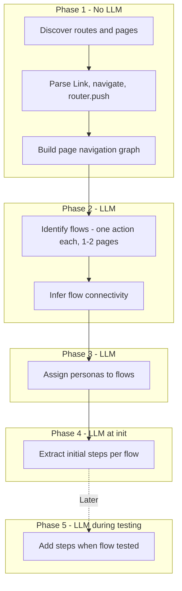

# Init/Bootstrap Implementation Spec

This document specifies the new route-first init/bootstrap implementation for Perceo, aligned with the [conceptual boundaries](../README.md#perceo-conceptual-model) (Personas, Flows, Steps). Each flow is one specific action isolated to one page or at most a couple of pages.

## High-Level Pipeline

## Phase 1: Route Graph Discovery (No LLM)

**Location:** New package or module (e.g., `packages/route-analyzer` or `apps/temporal-worker/src/utils/route-discovery.ts`)

- **Input:** Cloned repo, detected framework (nextjs, remix, react)
- **Actions:**
    - Discover routes/pages via framework conventions:
        - Next.js App: `app/**/page.tsx`, `app/**/layout.tsx`
        - Next.js Pages: `pages/**/*.tsx`
        - Remix: `app/routes/**/*.tsx`
    - Parse `Link`, `navigate()`, `router.push()` to extract page-to-page edges
    - Output: Route list + navigation graph (nodes = pages/routes, edges = links)
- **Output:** `{ routes: Route[], navigationGraph: { from: string, to: string }[] }`

## Phase 2: Flow Identification (1-2 LLM calls)

**Location:** Modify [apps/temporal-worker/src/activities/extraction.activities.ts](../apps/temporal-worker/src/activities/extraction.activities.ts) or new activity

- **Input:** Route graph, entry points (unauthenticated routes, public pages)
- **Actions:**
    - Call LLM with route graph + minimal auth snippets (e.g., middleware, layout guards)
    - Prompt: "Given this route graph, identify distinct user flows. Each flow must be one specific action isolated to one page or at most a couple of pages (e.g., 'Submit login form', 'Add item to cart'). Identify how flows connect when they share pages or when one leads to another."
    - Output: Named flows (one action each), page paths per flow (1-2 pages max), flow-to-flow connectivity
- **Output:** `Flow[]` with `graph_data` containing `pages`, `components`, and `connectedFlowIds` or equivalent. Each flow spans 1-2 pages.

## Phase 3: Persona-to-Flow Assignment (1 LLM call)

- **Input:** Flow graph, flow list, auth/role snippets
- **Actions:**
    - Call LLM: "Given these flows and auth hints, which personas use which flows?"
    - Output: Personas + `personaId -> flowIds` mapping
- **Output:** `Persona[]` with flow assignments

## Phase 4: Initial Steps at Init (1 LLM call per flow, optimized)

**Goal:** Generate an initial set of steps for each flow at init.

- **Input:** Per flow: flow name, description, 1-2 pages in scope, relevant page/component snippets (not full codebase)
- **Actions:**
    - Scope code context to only the 1-2 pages in the flow (not all 50 source files)
    - Call LLM: "Given this flow and its pages, list key assertions to verify when testing."
    - Output: Initial steps per flow
- **Output:** `Step[]` per flow, persisted to `steps` table

**Cost optimization:** Use flow-specific file subset (pages in path only) instead of broad glob. Batch or use smaller models for steps if viable.

## Phase 5: Incremental Steps During Testing

**Goal:** Add more steps as flows are tested.

- **Trigger:** When a flow is run in test mode (e.g., `perceo watch --analyze`, `perceo ci test`)
- **Actions:**
    - After a test run: if new UI elements, transitions, or failures are observed, optionally call LLM to suggest additional steps
    - Or: user-triggered "suggest steps" for a flow based on recent test output
- **Output:** Append new steps to existing steps for the flow
- **Implementation note:** This requires a new code path (e.g., activity `suggestStepsFromTestRun`) and integration with the test runner. Defer detailed implementation to a follow-up; the spec documents the intent.

## Workflow Changes

**File:** [apps/temporal-worker/src/workflows/bootstrap-project.workflow.ts](../apps/temporal-worker/src/workflows/bootstrap-project.workflow.ts)

- Replace diff-based phases (personas from diffs, flows from diffs) with:
    1. `discoverRouteGraphActivity` (new)
    2. `identifyFlowsFromGraphActivity` (new, replaces extractPersonasFromDiff + extractFlowsFromDiff)
    3. `assignPersonasToFlowsActivity` (new, or merged with identifyFlows)
    4. `extractInitialStepsForFlowActivity` (modified: scoped to flow pages only)
- Remove: `getCommitHistoryActivity` chunking, `extractPersonasFromDiffActivity`, `extractFlowsFromDiffActivity` in current form
- Keep: `persistPersonasActivity`, `persistFlowsActivity`, `persistStepsActivity`

## Expected Cost and Outcome

| Metric            | Current                           | Proposed                                 |
| ----------------- | --------------------------------- | ---------------------------------------- |
| LLM calls at init | ~40+                              | ~5-15 (flows + personas + initial steps) |
| Primary input     | Full git diffs, full source files | Route graph, flow-scoped snippets        |
| Flow granularity  | Multi-page journeys               | One action per flow, 1-2 pages           |
| Flow graph        | Not connected                     | Explicit flow-to-flow edges              |
| Steps at init     | All steps, full codebase          | Initial steps, flow-scoped context       |
| Steps over time   | Static                            | Initial + incremental during testing     |
